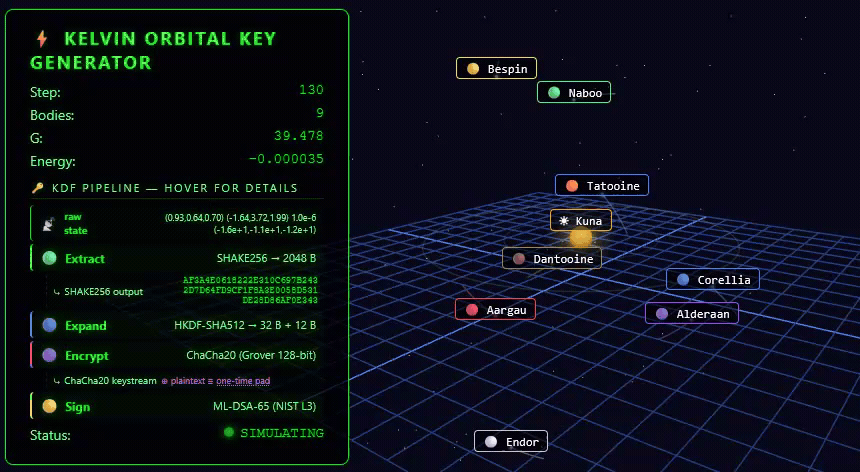

# Kelvin — Quantum-Resistant Chaotic-Entropy Stream Cipher

[](https://github.com/nliaudat/kelvin/actions/workflows/rust.yml)
[](licence.md)
[](https://crates.io/crates/kelvin)

> **Project Name:** kelvin — **K**ey derivation from n-body **E**lliptic **L**yapunov **V**ortex **IN**stability
> *A chaotic 3D n-body gravitational key derivation system*

> **⚠️ EXPERIMENTAL — Not for production use.** This is a research cryptosystem.
> It has not undergone formal cryptanalysis. See [Security](#security) for details.

Kelvin is a **deterministic key derivation function (KDF)** based on **fixed-point gravitational n-body simulation**, with reference stream cipher modes demonstrating the KDF output. The novel contribution is the chaotic n-body → SHAKE256 extraction pipeline. The stream cipher modes (V2 Chaos, V3 Photon, H Quantum) consume KDF seed material via standard SHAKE256 XOR — their security is bounded by SHAKE256's 128-bit post-quantum resistance, identical to any SHAKE256-based construction. The KDF security (inverting the n-body simulation from SHAKE256 output) is a novel conjecture, not a formally proven reduction.

The core insight: the n-body problem has no closed-form solution for N ≥ 3. Under the assumption that the n-body simulation is a one-way function (an unproven conjecture, see [Security Assumptions](documentation/security_assumptions.md)), an attacker cannot shortcut the simulation — they must run the same deterministic integration (Verlet or Euler) step-by-step to reproduce the keystream. The Euler method amplifies trajectory divergence ~10× faster than Verlet through numerical instability, creating stronger trajectory divergence (this is a conjecture about complicating initial-condition recovery, not a proven property). This creates a **computational asymmetry**: legitimate parties pay the simulation cost once, while attackers face the same cost for every guess.

> ⚠️ **Important caveat**: Like any stream cipher, known plaintext reveals the keystream for that session. With known plaintext, the n-body layer is bypassed and the attacker directly attacks SHAKE256 preimage resistance (256-bit classical, 128-bit quantum). The computational asymmetry protects the **KDF** (making brute-force config search expensive), not the **stream cipher** (which is bounded by SHAKE256 resistance).

Kelvin's XOR-based modes (V2 Chaos, V3 Photon, H Quantum, Prism, Split, Flare) produce a **quantum-resistant keystream** — data is XOR-encrypted byte-by-byte with keystream derived from SHAKE256 (NIST PQC standard). These modes (and V1 ChaCha20Poly1305 AEAD for authenticated bulk encryption) are structurally different from block ciphers or nonce-based stream ciphers: there is no nonce, no IV, no algebraic round function. No known attack is faster than brute force — and the effective security is 128-bit post-quantum (SHAKE256 bound).



## Quick Start

```bash
# Generate a random orbital configuration
cargo run -p kelvin-cli -- keygen --output key.json

# Encrypt a file
cargo run -p kelvin-cli -- encrypt --config key.json --input plaintext.txt --output ciphertext.bin

# Decrypt a file
cargo run -p kelvin-cli -- decrypt --config key.json --input ciphertext.bin --output decrypted.txt
```

## Mode Comparison

| Mode | Name | Cipher Type | Auth | Keystream | Speed (in-memory) | Use Case |
|------|------|-------------|:----:|-----------|:-----------------:|----------|
| **V1** | Kelvin-Secure | ChaCha20Poly1305 (AEAD) | ✅ AEAD | Finite (~28 GiB) | 🚀 1,644 MB/s | General purpose with authentication |
| **V2** | Kelvin-Chaos | **Per-Step Stream** (SHAKE256 XOR) | ✅ Optional | ≈Limited⁴ (1B step cap) | 🐌 34 MB/s | Streaming, real-time |
| **V3** | Kelvin-Photon | **Batch Stream** (HKDF→SHAKE256 XOR) | ✅ Optional | Finite | 🚀 542 MB/s | Bulk encryption |
| **H** | Kelvin-Quantum³ | **Hybrid Stream** (V3+V2 XOR) | ✅ Optional | ≈Unlimited | 🚀 512 MB/s | Best all-around |
| **—** | Kelvin-Prism | **HE Stream** (HKDF→SHAKE256) | ❌ | Finite | 🚀 ~542 MB/s | Stream key generation for HE |
| **—** | Kelvin-Split | **Split Stream** (HKDF→SHAKE256) | ❌ | Finite | 🚀 ~542 MB/s | XOR key splitting for HE |
| **—** | Kelvin-Flare | **FHE Stream** (HKDF→SHAKE256) | ❌ | Finite | 🚀 ~542 MB/s | FHE secret key generation |


> ³ The name "Quantum" refers to the hybrid V2+V3 architecture, not quantum-mechanical properties. The security of all Kelvin modes derives from classical chaotic n-body dynamics and standardized cryptographic primitives (SHAKE256, HKDF-SHA512), not from quantum mechanics.
> ⁴ V2 keystream is bounded by the simulation safety limit (1 billion steps) — see the Finite Precision Analysis in proof_of_concept.md for periodicity considerations. All finite-state chaotic systems eventually cycle; the practical limit is determined by the step count.


## What Makes Kelvin Novel

Kelvin derives cryptographic keys from the **fixed-point gravitational n-body simulation** — a novel approach to key derivation that differs from traditional KDFs (algebraic hardness, memory-hard functions) and from other chaos-based cryptosystems.

> ⚠️ **Known Prior Art:** The broad concept of "n-body chaotic cryptography" was previously described by Chai et al. (2025) using a restricted four-body memristor system for image encryption. Kelvin distinguishes itself via: (1) full gravitational 10-body simulation (not restricted), (2) Q32.64 fixed-point arithmetic (cross-platform deterministic), (3) general-purpose multi-mode architecture (not image-specific). See [Patent Review #3](documentation/patent_review/patent_review_3.md) for full analysis.


## How It Works

Kelvin's security rests on the unpredictability of chaotic n-body dynamics. The system follows a deterministic pipeline that transforms a shared orbital configuration into a **quantum-resistant keystream**:

```
OrbitalConfig (masses, positions, velocities, G, ε)
    │
    ▼
┌──────────────────────────────────────────────────────────────┐
│  Phase 1: Orbital Simulation (Verlet/Euler)                   │
│  • Simulate N-body gravitational dynamics (30 DOF chaos)      │
│  • Monitor for stability (Lyapunov, ejections, collapses)     │
│  • Run for total_steps iterations (chaotic regime enforced)   │
└──────────────────────────┬───────────────────────────────────┘
                           │
                           ▼
┌──────────────────────────────────────────────────────────────┐
│  Phase 2: Entropy Extraction (SHAKE256)                       │
│  • Hash final orbital state + physical constants + forces     │
│  • Produce 2048-byte entropy pool                             │
│  • Domain-separated: V2/V3/H/Prism/Split/Flare are isolated  │
└──────────────────────────┬───────────────────────────────────┘
                           │
                           ▼
┌──────────────────────────────────────────────────────────────┐
│  Phase 3: Key Schedule (HKDF-SHA512 + BLAKE3)                 │
│  • Derive keystream: key ≥ plaintext, no nonce, no IV         │
│  • Reseed pool after each key (forward secrecy — no reuse)    │
│  • Exhausted after max_keys (each key used exactly once)      │
└──────────────────────────┬───────────────────────────────────┘
                           │
                           ▼
          Quantum-Resistant Stream Cipher Keystream
          (computationally indistinguishable from random)
```

The resulting keystream is used as a **quantum-resistant stream cipher**: data is XOR-encrypted byte-by-byte with the keystream. Since the keystream is derived via SHAKE256 (NIST PQC standard) from chaotic dynamics with no closed-form solution, it is computationally indistinguishable from random — and no known quantum algorithm can shortcut the simulation.


## Why a Stream Cipher Without Nonces?

Kelvin's V2 (Chaos), V3 (Photon), H (Quantum), Prism, Split, and Flare modes are all **XOR-based stream ciphers**. Unlike traditional stream ciphers (ChaCha20, AES-CTR) that require a nonce/IV, Kelvin derives its keystream entirely from the orbital configuration — there is no nonce to manage, rotate, or accidentally reuse.

In a standard nonce-based stream cipher, encrypting the same data twice under the same key with different nonces produces different ciphertexts. Kelvin achieves this differently: the orbital configuration acts as both key and context — each instance consumes its keystream sequentially through key schedule reseeding, so two different messages encrypted with the same config at different step counts produce different keystream segments.

> ⚠️ **Important caveat**: The absence of a nonce means there is no built-in defense against config reuse between instances. Loading the same orbital configuration into two separate `Kelvin` instances and encrypting different data with each produces identical keystream prefixes — this is the two-time pad problem. Users MUST ensure each orbital configuration is used by at most one `Kelvin` instance.

Unlike block ciphers (AES) or nonce-based stream ciphers (ChaCha20), Kelvin modes have:

- **No nonce to manage** — uniqueness is achieved through per-instance key schedule consumption (see caveat above)
- **No padding or IV** — ciphertext length = plaintext length
- **No algebraic structure** — nothing for Shor's algorithm to factor or lattice reduction to exploit (this is true of all symmetric stream ciphers, not unique to Kelvin)
- **Quantum-resistant foundation** — SHAKE256 (NIST PQC) has no known quantum shortcut beyond Grover's (128-bit effective)
- **Malleability is the only attack** — use `--auth` (KMAC128) to defeat it

See the [Stream Cipher Security Analysis](documentation/stream_cipher_security.md) for the full security argument.


## Security

### What Kelvin Provides

- **Stream cipher architecture**: V2/V3/H/Prism/Split/Flare all use XOR-based stream ciphers with SHAKE256 keystream — quantum-resistant, no nonce, no key reuse risk
- **Deterministic KDF**: Same orbital configuration → same keystream (verified by 18 determinism tests)
- **Chaotic divergence**: Lyapunov exponent λ ≈ 0.693 (positive → chaotic regime)
- **Key derivation chaining** (labeled "forward secrecy"): BLAKE3 reseeding prevents past key recovery from future state, but this is NOT Perfect Forward Secrecy — if the orbital config is compromised, all past and future keys can be recomputed. True PFS would require ephemeral key material.
- **Constant-time operations**: All fixed-point arithmetic verified via dudect-bencher (|t| < 5)
- **Memory safety**: `#![forbid(unsafe_code)]` across all crates
- **Zeroization**: All secret material cleared on drop (verified by runtime read-back test)
- **Formal verification**: Kani proofs L0–L4 (safety, functional equivalence, composite correctness, pipeline integrity, determinism) — see [Formal Verification](#formal-verification) section
- **NIST SP 800-90B compliance**: Built-in health tests (repetition, adaptive proportion, runs, longest run, Shannon entropy, chi-square, correlation)
- **NIST SP 800-22 compliance**: All 15 statistical tests pass on orbital keystream
- **Post-quantum identity**: ML-DSA-65 (FIPS 204) signatures + ML-KEM-768 (FIPS 203) key encapsulation
- **⚠️ Reseeding note**: The SHAKE256 reseeding is a deterministic transformation — it cannot break finite-precision periodicity in the orbital simulation. See [Finite Precision Analysis](documentation/proof_of_concept.md#48-finite-precision-periodicity-analysis-cang-et-al-2021--unsolved-concern).

### What Kelvin Does NOT Provide

- **Reduction to a standard hard problem**: No reduction to lattices, discrete log, or similar. Security estimates (C1–C5: information loss, Lyapunov certification, quantum hardness Ω(2⁹⁶⁰), keystream indistinguishability, configuration space ≥ 2¹⁹²⁰) are derived from physical chaos assumptions rather than algebraic hardness. These are plausibility arguments based on chaotic dynamics and SHAKE256 indistinguishability — not formal security reductions.
  - The ≥ 2¹⁹²⁰ config space figure is an estimate (≈ 40 effective bits × ~48 independent fields). See [Stream Cipher Security Analysis](documentation/stream_cipher_security.md) for the full derivation context.
- **Effective security bound**: All security levels (Standard/Paranoid/Maximum) are bounded by SHAKE256's 128-bit post-quantum effective security. Additional simulation steps increase setup cost but do not raise this bound.
- **Key exchange**: OrbitalConfig must be established out-of-band
- **Memory hardness**: Not a memory-hard KDF (no large memory requirements). The n-body simulation is inherently sequential (each step depends on prior state), preventing GPU/ASIC speedup within a single run. Brute-force parallelism across independent guesses is possible, but the computational asymmetry and ≥ 2¹⁹²⁰ keyspace bound make this infeasible.
- **Information-theoretic security**: Kelvin's XOR modes are computational stream ciphers — keystream indistinguishability is bounded by C4 (Adv(A) ≤ negl(n) + 2⁻⁹⁶⁰). True information-theoretic security requires statistically perfect key randomness equal to message length, which no practical cryptosystem provides. For any real-world adversary, computational indistinguishability via SHAKE256 (NIST FIPS 202) is cryptographically equivalent. See the [Stream Cipher Security Analysis](documentation/stream_cipher_security.md) for the full argument.


## Architecture

Kelvin is organized as a Rust workspace with multiple crates:

```
kelvin-core/     — Fixed-point Q32.64 arithmetic, n-body simulation, entropy extraction
kelvin-kdf/      — Key schedule, HKDF-SHA512 derivation, BLAKE3 reseeding
kelvin-stream/   — Streaming cipher modes (ChaCha20Poly1305, SHAKE256 XOR)
kelvin/          — Top-level API (Kelvin, KelvinPhoton, KelvinQuantum, etc., + mode trait)
kelvin-cli/      — Command-line interface (encrypt, decrypt, generate, analyze)
kelvin-ffi/      — C FFI bindings for language interop
fuzz/            — Differential fuzzing vs Python mpmath reference
tests/
├── kelvin-test-server/  — Integration test server
├── kelvin-test-client/  — Integration test client
├── constant_time_bench/ — dudect-bencher side-channel analysis
├── nist_tests/          — SP 800-90B IID health tests
├── nist_800_90b/        — SP 800-90B keystream generation tooling
├── entropy_analysis/    — Statistical entropy analysis harness
├── information_loss/    — C1 information loss empirical validation
├── keystream_indistinguishability/ — C4 keystream indistinguishability
├── lyapunov_certification/ — C2 Lyapunov certification
├── quantum_hardness/    — C3 quantum hardness analysis
├── configuration_space/ — C5 configuration space analysis
├── shake256_bench/      — SHAKE256 throughput benchmarking
├── comparative_bench/   — Criterion benchmarks vs AES-256-CTR
└── zeroize_verify/      — Memory zeroization verification
libs/
└── python/kelvin_pyo3/  — PyO3 language bindings
```

## Installation

### From Source

```bash
# Prerequisites: Rust 1.75+ (install via rustup)
git clone https://github.com/nliaudat/kelvin.git
cd kelvin
# Use --release for optimization (simulation is CPU-intensive)
cargo build --release
```

### From Crates.io

```bash
cargo add kelvin
```

## Usage Examples

### Basic Encryption/Decryption

```rust
use kelvin::{Kelvin, OrbitalConfig};

// Generate a random 5-body orbital configuration
let config = OrbitalConfig::chaotic_default();

// Create encryption instance (runs simulation)
let mut alice = Kelvin::new(config.clone()).expect("Kelvin::new");

// Encrypt data (in-place)
let mut plaintext = b"Hello, Kelvin!".to_vec();
alice.encrypt(&mut plaintext).unwrap();

// Create decryption instance (separate instance, same config)
let mut bob = Kelvin::new(config).expect("Kelvin::new");
bob.decrypt(&mut plaintext).unwrap();

assert_eq!(&plaintext, b"Hello, Kelvin!");
```

### Streaming Mode (V2)

```rust
use kelvin::KelvinStreaming;

let mut stream = KelvinStreaming::new(config, 1024).unwrap();
let mut data = b"Large file...".to_vec();
stream.encrypt(&mut data).unwrap();
```

### CLI Usage

```bash
# Generate a random configuration
kelvin keygen --output my-key.json

# Encrypt a file
kelvin encrypt --config my-key.json --input secret.txt --output secret.enc

# Decrypt a file
kelvin decrypt --config my-key.json --input secret.enc --output secret.txt

# Analyze chaos quality
kelvin analyze --config my-key.json
```

## Performance

| Operation | Throughput (in-memory) | File I/O Bound (1 GB) |
|-----------|:----------------------:|:---------------------:|
| V1 Secure (ChaCha20Poly1305) | **1,644 MB/s** | ~48 MB/s |
| V2 Chaos (per-step SHAKE256 XOR) | **34 MB/s** | ~48 MB/s |
| V3 Photon (HKDF→SHAKE256 XOR) | **542 MB/s** | ~48 MB/s |
| H Quantum (hybrid V3+V2 XOR) | **512 MB/s** | ~48 MB/s |
| Setup + Keygen (5 bodies, 1M steps) | ~1.1s | — |
| Setup + Keygen (5 bodies, 10M steps) | ~12.5s | — |

> **Note:** All crypto throughput is measured on an AMD Ryzen 5 5600 with 1 GB buffers (in-memory, no file I/O). For 1 MiB buffers (smaller/fresh data), throughput is lower (e.g., KelvinQuantum H: 438 MB/s) — see [Comparative Benchmarks](documentation/bench_comparative.md). File-based benchmarks are bottlenecked by disk I/O (~48 MB/s) regardless of mode. See the [SHAKE256 Benchmark Analysis](documentation/shake256_benchmark_analysis.md) for details.

## Formal Verification

Kelvin follows Apple's corecrypto blueprint for formal verification using the Kani Rust Verifier:

| Level | What is Proved | Status |
|-------|---------------|--------|
| L0: Safety | No panics, no overflows under bounded inputs | ✅ Done |
| L1: Functional Equivalence | Arithmetic ops match mathematical spec within dynamically scaled error bounds | ✅ Done |
| L2: Composite Correctness | `compute_accelerations` matches Newtonian gravity via force-based assertions | ✅ Done |
| L3: Pipeline Integrity | Full `simulate_and_extract_seed` produces correct output | ✅ Done |
| L4: Determinism | Bit-identical results across platforms (SSE2, AVX, AVX2, NEON) | ✅ Done |

See [formal_verification.md](documentation/formal_verification.md) for details.

## Documentation

### Architecture & Design
- [Usage Guide](documentation/usage.md) — Detailed API documentation
- [Stream Cipher Security Analysis](documentation/stream_cipher_security.md) — Why Kelvin's stream cipher provides strong security guarantees
- [Stream Cipher Mode Study](documentation/Kelvin_Stream_Cipher_Study.md) — Mode comparison and hybrid architecture
- [Mode Flowcharts](documentation/mode_flowcharts.md) — Visual pipeline diagrams for each mode
- [Homomorphic Cryptosystem](documentation/homomorphic_cryptosystem.md) — HE integration with Prism/Split/Flare
- [Security Assumptions](documentation/security_assumptions.md) — Codified security assumptions with enforcement locations

### Formal Verification & Security
- [Formal Verification](documentation/formal_verification.md) — Kani proof strategy (L0–L4)
- [Security Analysis](documentation/stream_cipher_security.md) — Quantum-resistant stream cipher security argument
- [Patent Landscape #1](documentation/patent_review/patent_review_1.md) — Prior art analysis (overview)
- [Patent Landscape #2](documentation/patent_review/patent_review_2.md) — Prior art analysis (in-depth)
- [Patent Landscape #3](documentation/patent_review/patent_review_3.md) — Prior art analysis (conclusion)
- [Project History](documentation/project_history.md) — Development timeline and milestones

### Performance & Benchmarks
- [SHAKE256 Benchmark Analysis](documentation/shake256_benchmark_analysis.md) — Detailed throughput breakdown (in-memory vs I/O-bound)
- [Comparative Benchmarks](documentation/bench_comparative.md) — Kelvin vs AES-256-GCM vs ChaCha20-Poly1305
- [1 GB Benchmark Report](documentation/bench_1gb.md) — File-based 1 GB encryption tests
- [Entropy Analysis Report](documentation/entropy_report.md) — NIST SP 800-90B statistical results
- [NIST SP 800-90B Report](documentation/nist_800_90b_report.md) — Formal NIST validation tooling
- [NIST Test Anomalies](documentation/nist_test_anomalies.md) — Edge cases and known limitations

### Research & Theory
- [Proof of Concept](documentation/proof_of_concept.md) — Test results and benchmarks
- [Quantum Resistance Analysis](documentation/quantum_analysis.md) — Post-quantum security analysis
- [Keyspace Analysis](documentation/keyspace_analysis.md) — Brute-force resistance bounds
- [Seed Extraction](documentation/seed_extraction.md) — Entropy extraction methodology
- [Sun Mass Randomization](documentation/sun_mass_randomization.md) — Initial condition entropy
- [Euler vs Verlet](documentation/Euler_vs_Verlet.md) — Integration method comparison
- [Citations](documentation/citations.md) — Academic references and bibliography

### Integration & Platform
- [rustcrypto Integration Plan](documentation/rustcrypto_integration_plan.md) — Roadmap for upstream RustCrypto compatibility
- [NIST PQ Signatures](documentation/nist_pq_signatures.md) — ML-DSA-65 and ML-KEM-768 integration
- [Windows DLL Tool Fix](documentation/windows_dlltool_fix.md) — Cross-compilation workaround

### Operations
- [Production Readiness Plan](production_readiness_plan.md) — Roadmap to 1.0


## Academic Context

Kelvin builds on a rich body of research in chaos-based cryptography:

- **Chai et al. (2025)** — First known n-body chaotic image encryption (four-body memristor system)
- **Song et al. (2025)** — CryptoChaos: hybrid chaos-cryptography framework
- **Cang, Kang & Wang (2021)** — Conservative Sprott-A PRNG with finite precision analysis
- **Jawad (2025)** — DUff-skg: chaotic Duffing oscillator for FHE key generation
- **Apple '559 (expired)** — Original patent for chaotic dynamics in cryptography

See [REFERENCES.bib](REFERENCES.bib) for the full bibliography.

## License

Licensed under either of:

- Apache License, Version 2.0 ([LICENSE-APACHE](licence.md) or http://www.apache.org/licenses/LICENSE-2.0)
- MIT license ([LICENSE-MIT](licence.md) or http://opensource.org/licenses/MIT)

at your option.

## Contributing

Contributions are welcome! Please see [CONTRIBUTING.md](CONTRIBUTING.md) for guidelines.

**Security issues**: Report via the [SECURITY.md](SECURITY.md) process.
