# Kelvin Cryptosystem — Mode Flowcharts & Sequence Diagrams

## Overview

The Kelvin cryptosystem provides five encryption modes, each with different
security properties and performance characteristics:

| Mode | Cipher | Authentication | Key Derivation |
|------|--------|---------------|----------------|
| **Secure** | ChaCha20 stream cipher | BLAKE3 keyed hash (32-byte tag) | HKDF-SHA512 from orbital seed |
| **Chaos** | Per-step SHAKE256 XOR | None (malleable) | Orbital simulation (1 step per chunk) |
| **Photon** | HKDF→SHAKE256 XOR | None (malleable) | HKDF-SHA512 → SHAKE256 XOF |
| **Quantum** | Hybrid cache+XOR + orbital reseed | None (malleable) | BLAKE3 → SHAKE256 cache + orbital reseed |
| **Prism** | OTP key generator (HE integration) | None (XOR is malleable) | HKDF-SHA512 → SHAKE256 XOF (isolated domain) |

---

## Master Flowchart — Mode Selection

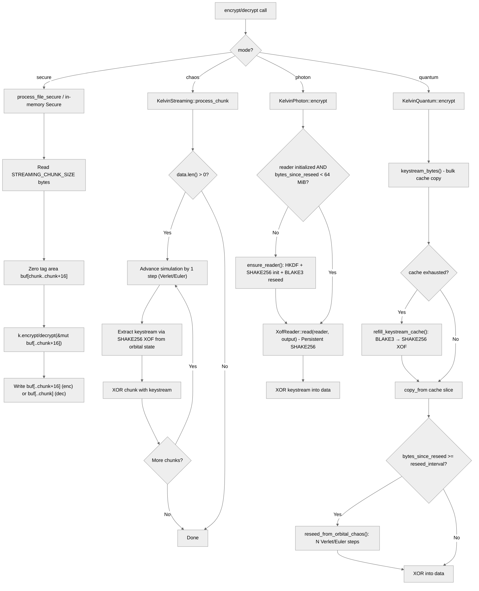

---

## Secure Mode — ChaCha20 + BLAKE3 Keyed Authentication

### Architecture

Secure mode uses the ChaCha20 stream cipher for encryption and a BLAKE3 keyed
hash for authentication. The authentication key is derived from the ChaCha20
key+nonce using BLAKE3 key derivation, ensuring the tag is cryptographically
bound to the encryption key.

### Wire Format

```
ciphertext (same length as plaintext) || final_tag (32 bytes)
```

### Flowchart

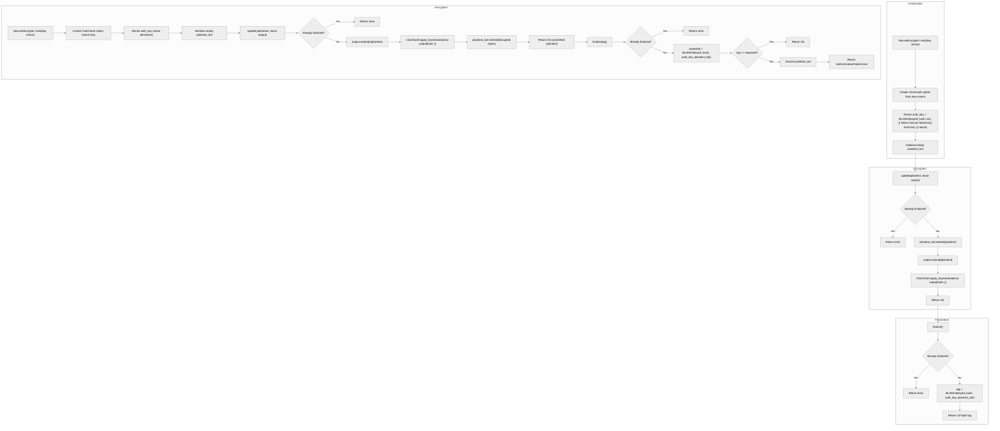

### Sequence Diagram

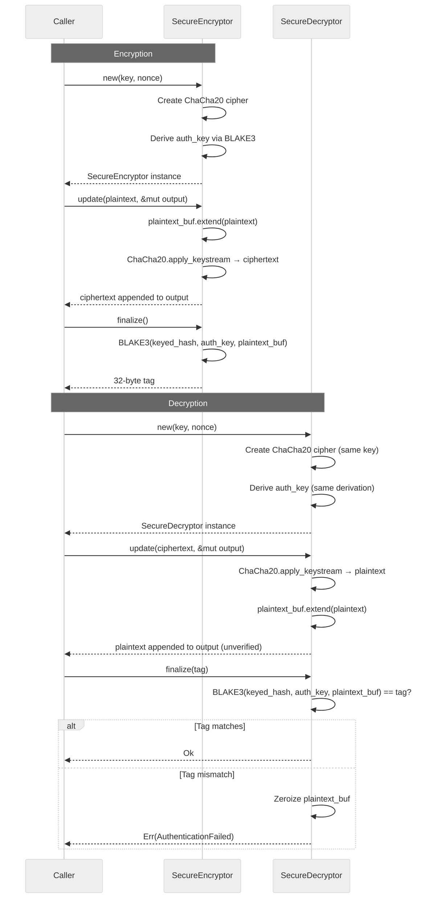

### Key Properties

| Property | Value |
|----------|-------|
| **Encryption** | ChaCha20 stream cipher (XOR with keystream) |
| **Authentication** | BLAKE3 keyed hash (32-byte tag) |
| **Key size** | 32 bytes (ChaCha20) |
| **Nonce size** | 12 bytes (IETF ChaCha20 variant) |
| **Tag size** | 32 bytes |
| **Streaming** | Yes — arbitrary chunk sizes via `StreamEncrypt`/`StreamDecrypt` |
| **Forward secrecy** | No — key reuse reveals plaintext |
| **Quantum resistance** | No — ChaCha20 has 128-bit quantum security (Grover's algorithm) |

---

## Chaos Mode — Per-Step SHAKE256 XOR (V2 Streaming)

### Architecture

Chaos mode (V2 Streaming) advances the n-body orbital simulation by one step
for each chunk of data processed. Each step extracts a unique keystream from
the current chaotic orbital state via SHAKE256 XOF, then XORs it with the data.

This is the only mode that uses **true orbital simulation** as the keystream
source, making it the most computationally expensive but also the most
entropy-rich mode.

### Flowchart

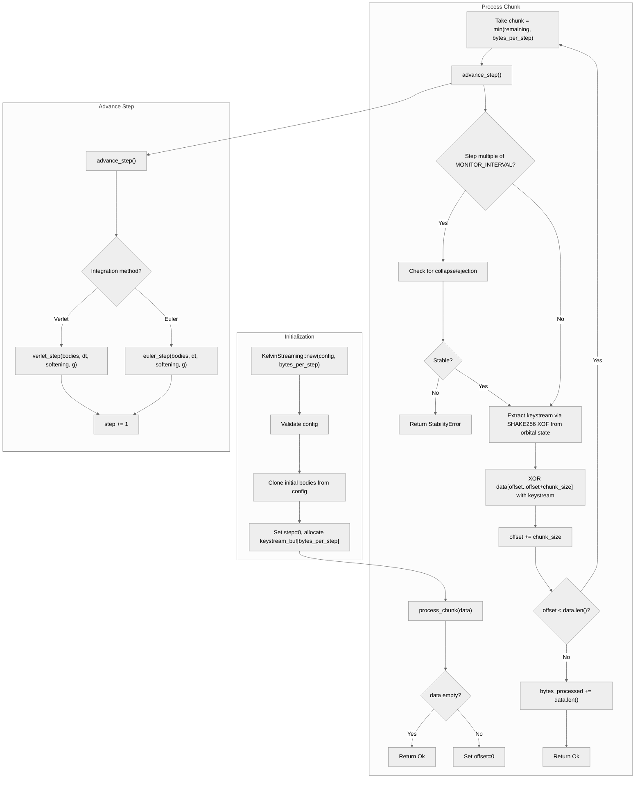

### Sequence Diagram

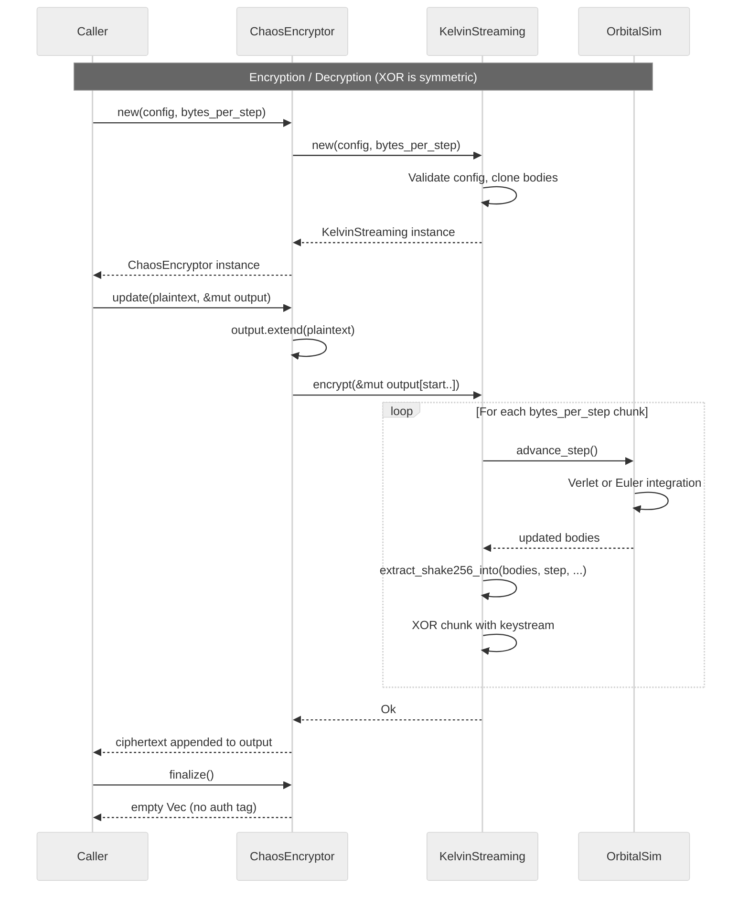

### Key Properties

| Property | Value |
|----------|-------|
| **Encryption** | Per-step SHAKE256 XOR (one simulation step per chunk) |
| **Authentication** | None (malleable) |
| **Keystream source** | Orbital simulation state → SHAKE256 XOF |
| **Chunk size** | Configurable (`bytes_per_step`, default 1 MiB) |
| **Integration** | Verlet (default) or Euler |
| **Stability monitoring** | Every 10,000 steps — checks collapse & ejection |
| **Forward secrecy** | Yes — each step produces unique chaotic state |
| **Quantum resistance** | Yes — SHAKE256 provides 256-bit classical / 128-bit quantum security |
| **Performance** | Slowest mode — each chunk requires an n-body simulation step |

---

## Photon Mode — HKDF→SHAKE256 XOR (V3)

### Architecture

Photon mode (V3) solves the original V1 bottleneck: V1 ran HKDF per 44-byte
key, using only 0.27% of HKDF's capacity. V3 uses HKDF's full capacity to
derive a SHAKE256 XOF seed, then produces arbitrary-length keystream:

```
2048B seed → HKDF-SHA512 → 64B XOF seed → SHAKE256 → unlimited keystream
```

A persistent SHAKE256 XOF reader is kept alive across chunks, only re-created
every 64 MiB via HKDF + BLAKE3 reseed.

### Flowchart

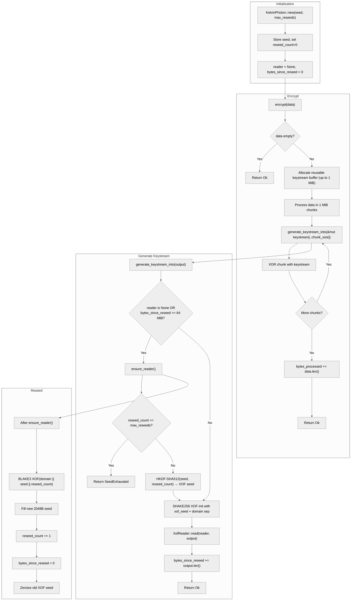

### Sequence Diagram

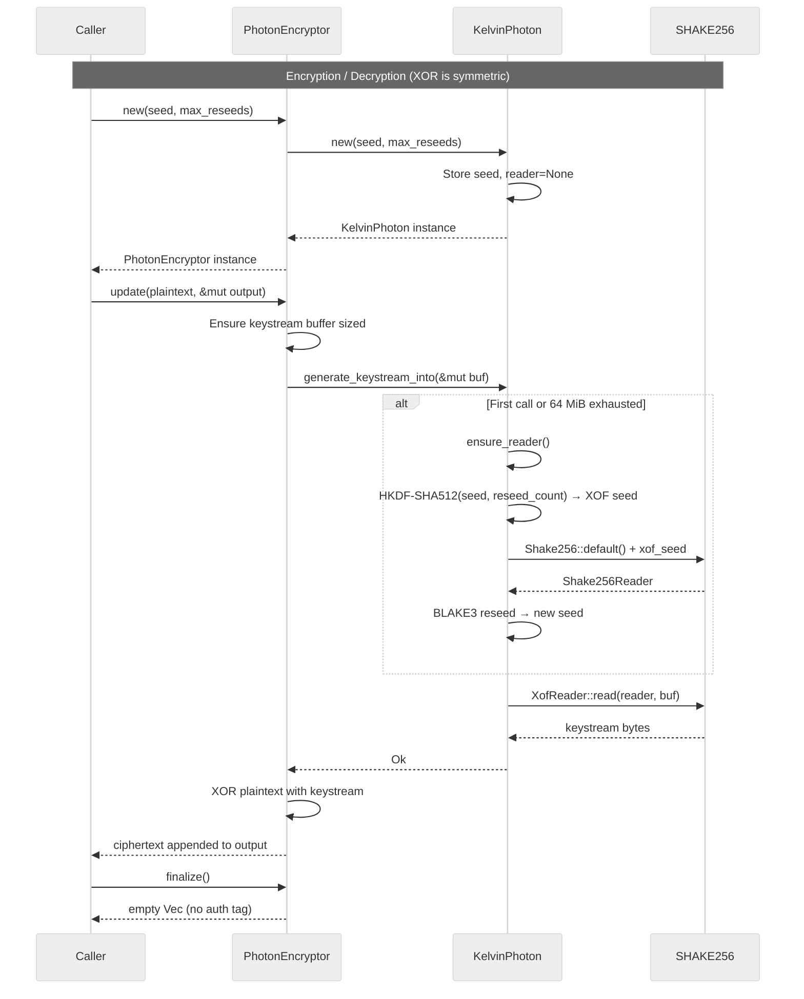

### Key Properties

| Property | Value |
|----------|-------|
| **Encryption** | HKDF→SHAKE256 XOR |
| **Authentication** | None (malleable) |
| **Keystream source** | HKDF-SHA512 → SHAKE256 XOF (persistent reader) |
| **Reseed interval** | 64 MiB |
| **Reseed mechanism** | BLAKE3 XOF (forward secrecy) |
| **Chunk size** | 1 MiB (configurable via `KEYSTREAM_CHUNK_SIZE`) |
| **Forward secrecy** | Yes — BLAKE3 reseed derives fresh seed each interval |
| **Quantum resistance** | Yes — SHAKE256 provides 256-bit classical / 128-bit quantum security |
| **Performance** | Fast — HKDF called only every 64 MiB |

---

## Quantum Mode — Hybrid Cache+XOR + Orbital Reseed (H)

### Architecture

Quantum mode (H) combines the orbital chaos KDF with a quantum-resistant
stream cipher (SHAKE256 XOF). Unlike Photon (which uses deterministic
HKDF→SHAKE256), Quantum periodically refreshes its base seed with **fresh
orbital entropy** via `reseed_from_orbital_chaos`:

```
2048B base seed → BLAKE3 XOF → perturbation → orbital state
  ↓
SHAKE256 XOF → keystream cache (1 MiB)
  ↓
XOR with plaintext/ciphertext
  ↓
Every N bytes: reseed_from_orbital_chaos
  → advance orbital simulation by M steps
  → extract fresh entropy via SHAKE256
  → XOR into base seed
```

### Flowchart

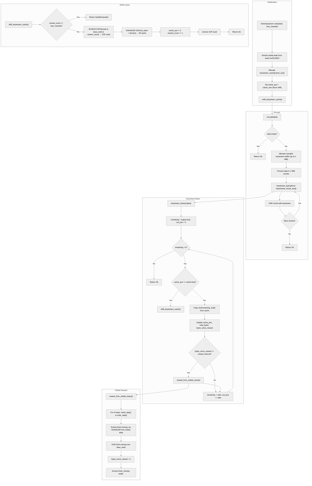

### Sequence Diagram

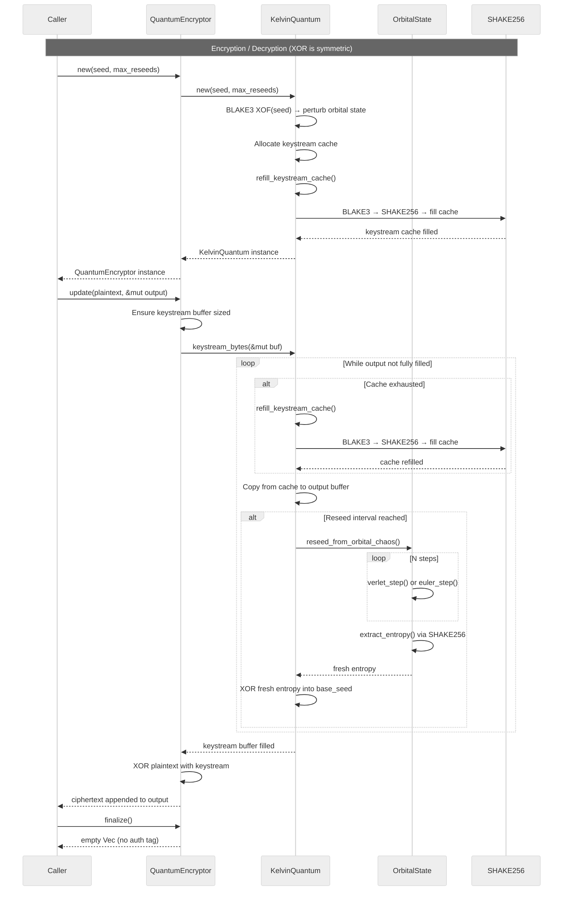

### Key Properties

| Property | Value |
|----------|-------|
| **Encryption** | Hybrid cache+XOR + orbital reseed |
| **Authentication** | None (malleable) |
| **Keystream source** | BLAKE3 → SHAKE256 cache (1 MiB default) |
| **Cache refill** | BLAKE3 XOF(domain || base_seed || reseed_count) → SHAKE256 |
| **Orbital reseed** | Every `reseed_interval_bytes` (configurable) |
| **Reseed mechanism** | N Verlet/Euler steps → SHAKE256 extract → XOR into base seed |
| **Orbital steps per reseed** | Configurable (`QUANTUM_DEFAULT_ORBITAL_STEPS`) |
| **Forward secrecy** | Yes — orbital reseed injects fresh chaotic entropy |
| **Quantum resistance** | Yes — SHAKE256 provides 256-bit classical / 128-bit quantum security |
| **Performance** | Moderate — cache refill is fast, orbital reseed is periodic |

---

## Mode Comparison

| Feature | Secure | Chaos | Photon | Quantum | Prism |
|---------|--------|-------|--------|---------|-------|
| **Encryption** | ChaCha20 stream | SHAKE256 XOR | HKDF→SHAKE256 XOR | Cache+XOR + orbital reseed | OTP key generator |
| **Authentication** | BLAKE3 keyed hash (32B) | None | None | None | None |
| **Keystream source** | ChaCha20 | Orbital simulation | HKDF→SHAKE256 | BLAKE3→SHAKE256 + orbital | HKDF→SHAKE256 (isolated) |
| **Forward secrecy** | ❌ | ✅ (per step) | ✅ (per 64 MiB) | ✅ (per reseed interval) | ✅ (per 64 MiB) |
| **Quantum resistant** | ❌ (128-bit) | ✅ | ✅ | ✅ | ✅ |
| **Performance** | Fast | Slowest | Fastest | Moderate | Fastest |
| **Streaming API** | ✅ | ✅ | ✅ | ✅ | ✅ |
| **Authenticated wrapper** | Built-in | `KelvinStreamingAuthenticated` | `KelvinPhotonAuthenticated` | `KelvinQuantumAuthenticated` | N/A (OTP only) |

---

## Prism Mode — OTP Key Generator for Homomorphic Encryption

### Architecture

Prism mode (`KelvinPrism`) is a standalone OTP key generator designed for
integration with homomorphic encryption (HE) systems. It wraps `KelvinPhoton`
internally but uses distinct domain separators to ensure Prism-generated OTP
keys are cryptographically isolated from normal V3 Photon keystream.

```
2048B seed → HKDF-SHA512 → 64B XOF seed → SHAKE256 → unlimited OTP keys
```

Each reseed derives a fresh 2048-byte pool via BLAKE3 for forward secrecy.
The domain separators (`DOMSEP_PRISM_KEYSTREAM_V1`, `DOMSEP_PRISM_RESEED_V1`)
ensure cryptographic isolation from V3 Photon.

### Flowchart

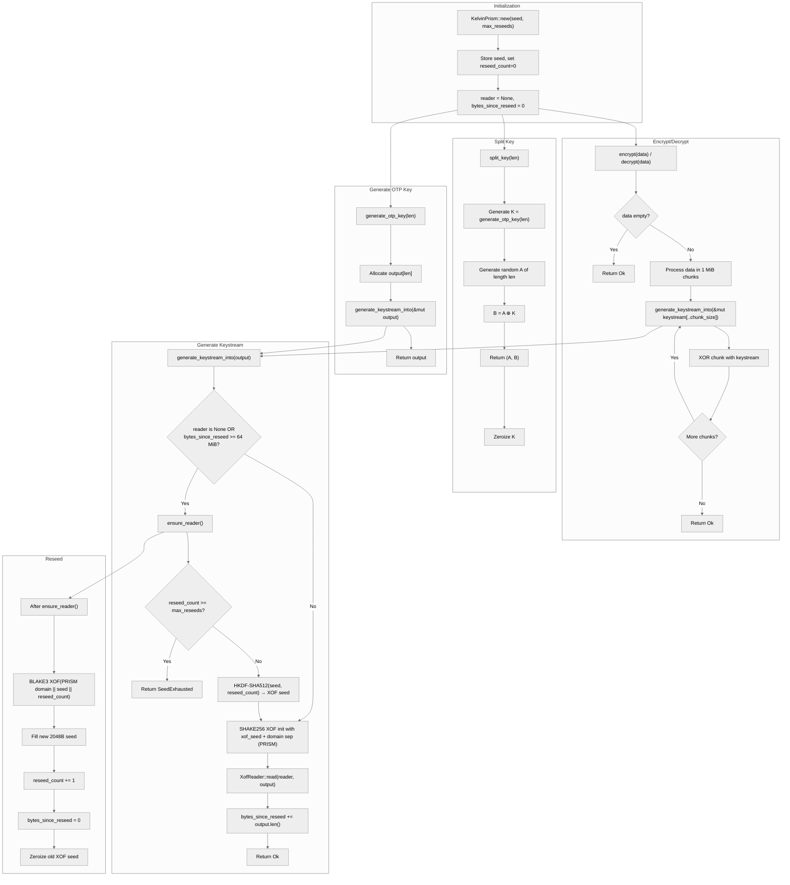

### Sequence Diagram

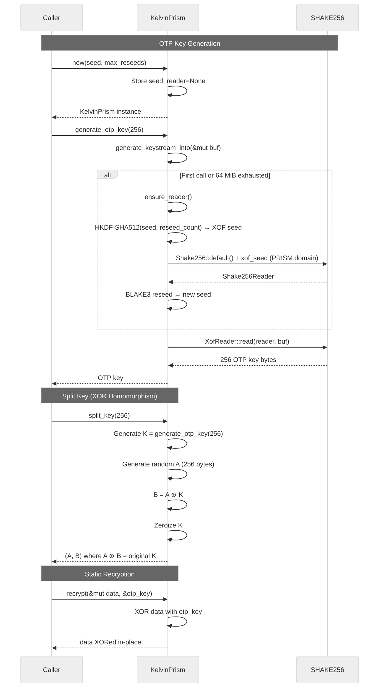

### Key Properties

| Property | Value |
|----------|-------|
| **Purpose** | Generate OTP keys for FHE recryption, split-key XOR homomorphism, chaotic FHE keygen |
| **Keystream source** | HKDF-SHA512 → SHAKE256 XOF (persistent reader) |
| **Domain separation** | `DOMSEP_PRISM_KEYSTREAM_V1` / `DOMSEP_PRISM_RESEED_V1` (isolated from V3 Photon) |
| **Reseed interval** | 64 MiB |
| **Reseed mechanism** | BLAKE3 XOF (forward secrecy) |
| **Forward secrecy** | Yes — BLAKE3 reseed derives fresh seed each interval |
| **Quantum resistance** | Yes — SHAKE256 provides 256-bit classical / 128-bit quantum security |
| **Authentication** | None (XOR is malleable) |
| **Key features** | `generate_otp_key()`, `split_key()`, `recrypt()` |

---

## Authenticated Wrappers

All three XOR-based modes (Chaos, Photon, Quantum) can be wrapped with
KMAC128 authentication via the authenticated wrappers:

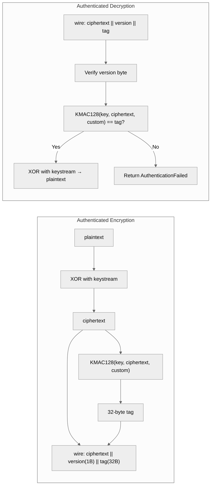

The MAC key is derived from the same 2048-byte seed using HKDF-SHA512 with a
distinct domain separator (`DOMSEP_MAC_KEY_V1`), preventing related-key attacks
between keystream generation and authentication.
